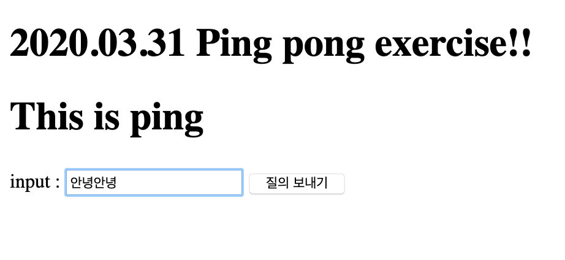
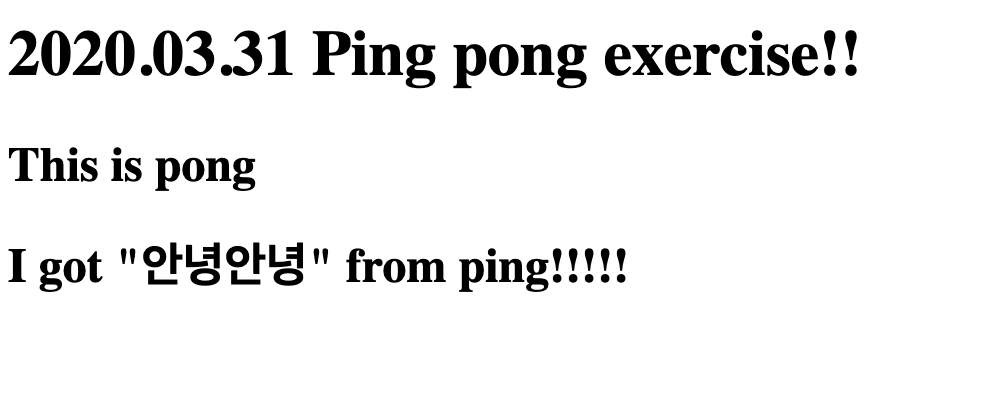

# 2020.03.31 exercise

1.  views.py

   ```python
   from django.shortcuts import render
   
   # Create your views here.
   def ping(request):
       return render(request, 'articles/ping.html')
   
   
   def pong(request):
       name = request.GET.get('name')
       context = {
           'name': name,
       }
       return render(request, 'articles/pong.html', context)
   ```

   

2. crud/urls.py

   ```python
   from django.contrib import admin
   from django.urls import path, include
   
   urlpatterns = [
       path('admin/', admin.site.urls),
       path('articles/', include('articles.urls')),
   ]
   ```

   

3. articles/urls.py

   ```python
   from django.urls import path, include
   from . import views
   
   
   urlpatterns = [
       path('ping/', views.ping),
       path('pong/', views.pong),
   
   ]
   ```

   

4. base.html

   ```html
   <!DOCTYPE html>
   <html lang="en">
   <head>
       <meta charset="UTF-8">
       <meta name="viewport" content="width=device-width, initial-scale=1.0">
       <title>Document</title>
   </head>
   <body>
       <h1>2020.03.31 Ping pong exercise!! </h1>
       
   
       
   </body>
   </html>
   ```

   

5. Ping.html

   ```html
   
   
       <h1>This is ping</h1>
       <form action="/articles/pong/">
           input : <input type="text" name="name">
           <input type="submit">
       </form>
   
   ```

   

6. pong.html

   ```html
   
   
       <h2>This is pong</h2>
       <h2> I got "{{ name }}" from ping!!!!!</h2>
   
   ```

   

Ping, pong페이지의 결과 사진

* ping
  
* pong



