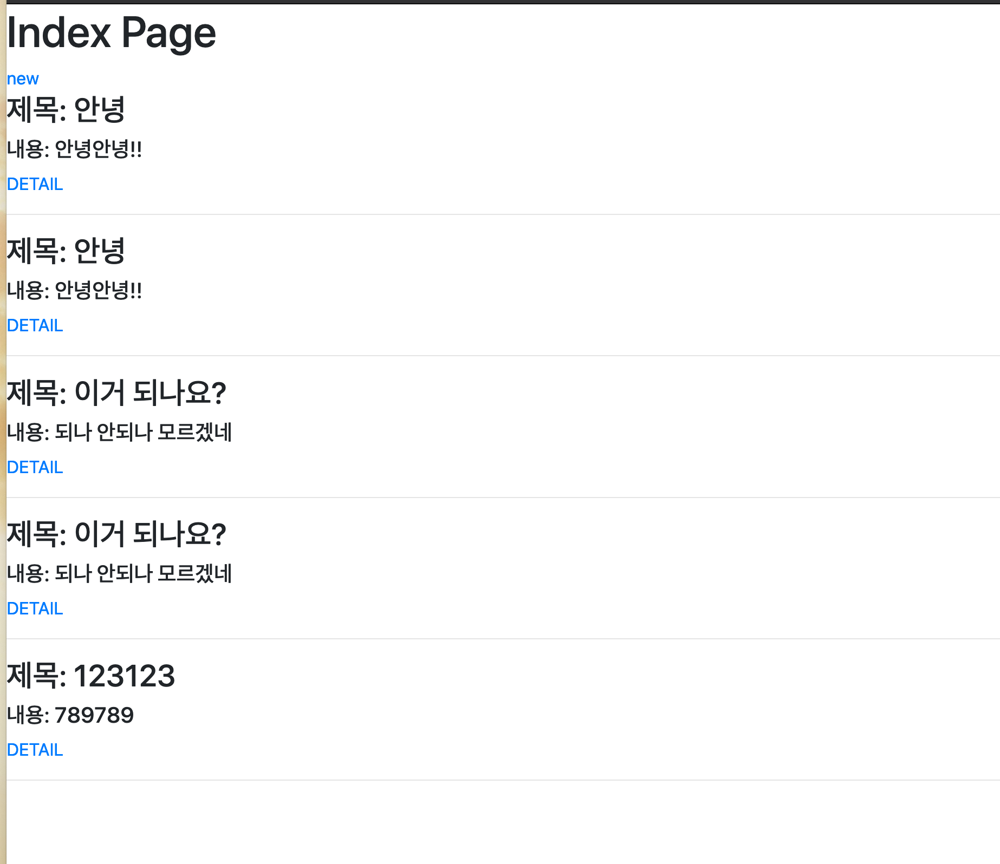
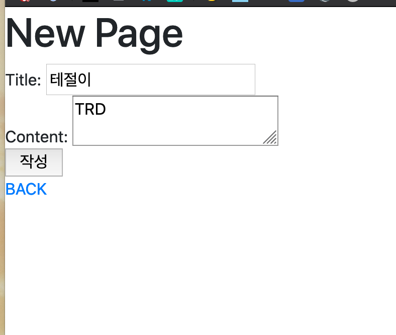
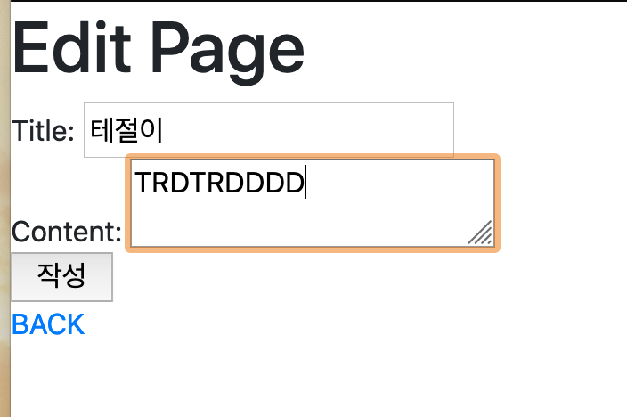

# 2020.04.06

## templates폴더

* base.html

```python
<!DOCTYPE html>
<html lang="en">
<head>
    <meta charset="UTF-8">
    <meta name="viewport" content="width=device-width, initial-scale=1.0">
    <title>Document</title>
    <link rel="stylesheet" href="https://stackpath.bootstrapcdn.com/bootstrap/4.4.1/css/bootstrap.min.css" integrity="sha384-Vkoo8x4CGsO3+Hhxv8T/Q5PaXtkKtu6ug5TOeNV6gBiFeWPGFN9MuhOf23Q9Ifjh" crossorigin="anonymous">
</head>
<body>

    
    

    <script src="https://code.jquery.com/jquery-3.4.1.slim.min.js" integrity="sha384-J6qa4849blE2+poT4WnyKhv5vZF5SrPo0iEjwBvKU7imGFAV0wwj1yYfoRSJoZ+n" crossorigin="anonymous"></script>
    <script src="https://cdn.jsdelivr.net/npm/popper.js@1.16.0/dist/umd/popper.min.js" integrity="sha384-Q6E9RHvbIyZFJoft+2mJbHaEWldlvI9IOYy5n3zV9zzTtmI3UksdQRVvoxMfooAo" crossorigin="anonymous"></script>
    <script src="https://stackpath.bootstrapcdn.com/bootstrap/4.4.1/js/bootstrap.min.js" integrity="sha384-wfSDF2E50Y2D1uUdj0O3uMBJnjuUD4Ih7YwaYd1iqfktj0Uod8GCExl3Og8ifwB6" crossorigin="anonymous"></script>
</body>
</html>
```

## CRUD 폴더

* urls.py

  ```python
  from django.contrib import admin
  from django.urls import path, include
  
  urlpatterns = [
      path('admin/', admin.site.urls),
      path('articles/', include('articles.urls')),
  ]
  ```

  

## articles 폴더

* Urls.py

  ```python
  from django.urls import path
  from . import views
  
  app_name = 'articles'
  urlpatterns = [
      path('', views.index, name='index'),
      path('new/', views.new, name='new' ),
      path('create/', views.create, name='create'),
      path('<int:pk>/', views.detail, name='detail'),
      path('<int:pk>/edit/', views.edit, name='edit'),
      path('<int:pk>/update/', views.update, name='update'),
      path('<int:pk>/delete/', views.delete, name='delete'),
  
  ]
  ```

  

* views.py

  ```python
  from django.http import Http404
  from django.shortcuts import render, redirect, get_object_or_404
  from .models import Article
  
  # Create your views here.
  def index(request):
      articles = Article.objects.all()
      context = {
          'articles': articles,
      }
      return render(request, 'articles/index.html', context)
  
  
  def new(request):
      return render(request, 'articles/new.html')
  
  
  def create(request):
      title = request.POST.get('title')
      content = request.POST.get('content')
      article = Article(title=title, content=content)
      article.save()
      return redirect(f'articles:detail', article.pk)
  
  
  def detail(request, pk):
      # try:
      #     article = Article.objects.get(pk=pk)
      # except Article.DoesNotExist:
      #     raise Http404("해당 문서는 찾을 수 없어용")
      article = get_object_or_404(Article, pk=pk)
      context = {
          'article': article,
      }
      return render(request, 'articles/detail.html', context)
  
  
  def edit(request, pk):
      # article = Article.objects.get(pk=pk)
      article = get_object_or_404(Article, pk=pk)
      context = {
          'article': article
      }
      return render(request, 'articles/edit.html', context)
  
  
  def update(request, pk):
      article = Article.objects.get(pk=pk)
      article.title = request.POST.get('title')
      article.content = request.POST.get('content')
      article.save()
  
      return redirect(f'/articles/{article.pk}/')
  
  
  def delete(request, pk):
      article = get_object_or_404(Article, pk=pk)
      article.delete()
      return redirect(f'/articles/')
  ```

  

* models.py

  ```python
  from django.db import models
  
  # Create your models here.
  class Article(models.Model):
      title = models.CharField(max_length=20)
      content = models.TextField()
      created_at  = models.DateTimeField(auto_now_add=True)
      updated_at  = models.DateTimeField(auto_now=True)
  ```

  

* admin.py

  ```python
  from django.contrib import admin
  from .models import Article
  # Register your models here.
  admin.site.register(Article)
  ```

### articles/templates/articles 폴더

* detail.html

  ```python
  
  
  
  <h1> Detail Page</h1>
  <h2>{{ article.title }}</h2>
  <br>
  {{ article.content }}
  <br>
  작성일: {{ article.created_at }}
  <br>
  수정일: {{ article.updated_at }}
  <br>
  <a href='/articles/{{ article.pk }}/edit/'>EDIT</a>
  <a href='/articles/{{ article.pk }}/delete/'>DELETE</a>
  <a href="">BACK</a>
  
  ```

  

* edit.html

  ```python
  
  
  
  <h1> Edit Page</h1>
  <form action='' method="POST">
      
      Title: <input type='text' name='title' value="{{ article.title }}">
      <br>
      Content: <textarea name='content'>{{ article.content }}</textarea>
      <br>
      <input type='submit' value='작성'>
  </form>
  <a href='/articles/'>BACK</a>
  
  
  ```

  

* index.html

  ```python
  
  
  
  <h1> Index Page</h1>
  <a href=''>new</a>
  
  
      <h3>제목: {{ article.title }}</h3>
      <h5>내용: {{ article.content }}</h5>
      <a href=''>DETAIL</a>
      <hr>
  
  
  
  ```

  

* new.html

  ```python
  
  
  
  <h1> New Page</h1>
  <form action='' method='POST'>
      
      Title: <input type='text' name='title'>
      <br>
      Content: <textarea name='content'></textarea>
      <br>
      <input type='submit' value='작성'>
  </form>
  <a href='#'>BACK</a>
  
  
  ```

  

## Screenshots









