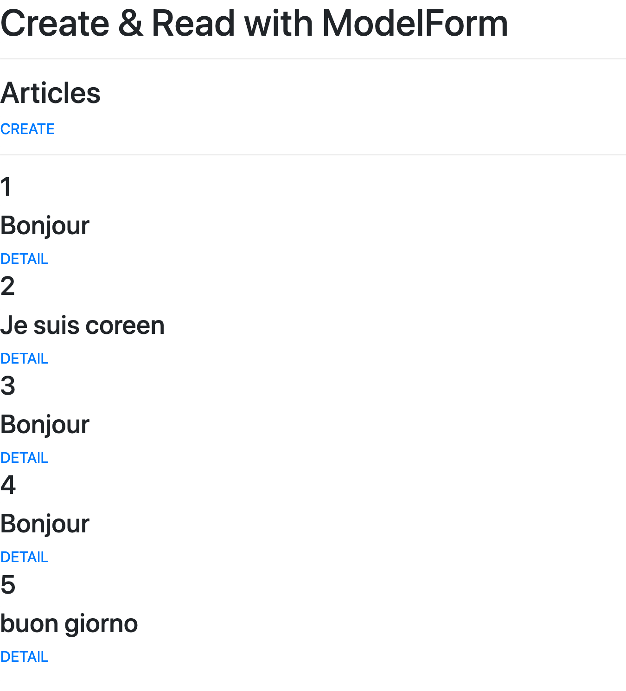
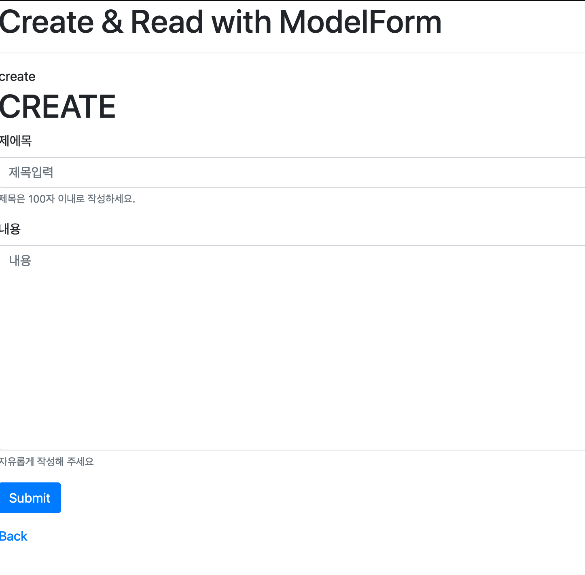
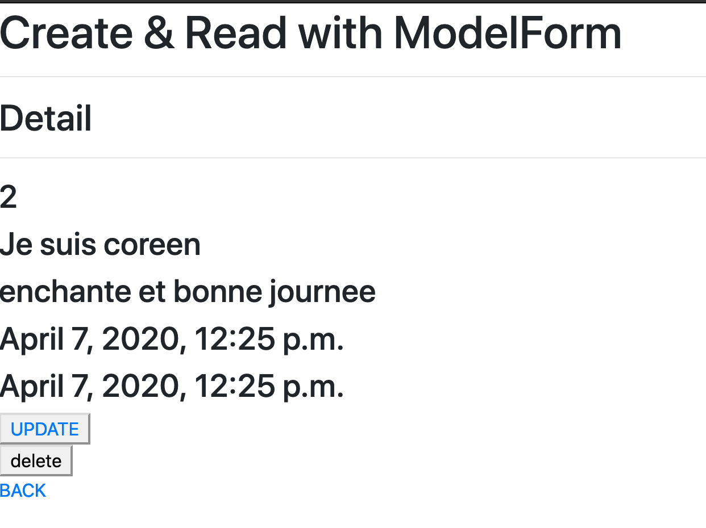

# 2020.04.07 exercise

1. views.py

   ```python
   from django.shortcuts import render, redirect, get_object_or_404
   from .models import Article
   from .forms import ArticleForm
   from django.views.decorators.http import require_POST
   
   # Create your views here.
   def index(request):
       articles = Article.objects.all()
       context = {
           'articles': articles,
       }
       return render(request, 'articles/index.html', context)
   
   
   def create(request):
       if request.method == 'POST':
           form = ArticleForm(request.POST)
           if form.is_valid():
               form.save()
               return redirect('articles:index')
       else:
           # GET(과거의 new 역할)
           form = ArticleForm()
   
       # 1. GET이후의 context는 비어있는 평범한 form
       # 2. POST에서 유효성 검증을 통과하지 못하면,
       # 에러메시지가 포함된 form이 넘어간다.
       context = {
           'form': form,
       }
       return render(request, 'articles/form.html', context)
   
   
   def detail(request, pk):
       article = get_object_or_404(Article, pk=pk)
       context = {
           'article': article,
       }
       return render(request, 'articles/detail.html', context)
   
   
   def update(request, pk):
       article = get_object_or_404(Article, pk=pk)
       if request.method == 'POST':
           form = ArticleForm(request.POST, instance=article)
           if form.is_valid():
               form.save()
               return redirect('articles:detail', article.pk)
   
       else:
           #수정시에는 해당 article 인스턴스를 넘겨줘야 한다.
           form = ArticleForm(instance=article)
   
       context = {
           'form': form,
           'article': article,
       }
       return render(request, 'articles/form.html', context)
   
   
   @require_POST
   def delete(request, pk):
       article = get_object_or_404(Article, pk=pk)
       article.delete()
       return redirect('articles:index')
   ```

   

2. forms.py

   ```python
   from django import forms
   from .models import Article
   
   class ArticleForm(forms.ModelForm):
       title = forms.CharField(
           max_length=100,
           label='제에목',
           help_text = '제목은 100자 이내로 작성하세요.',
           widget=forms.TextInput(
               attrs={
                   'class': 'my-input',
                   'placeholder': '제목입력',
               }
           )
       )
       content = forms.CharField(
           label='내용',
           help_text='자유롭게 작성해 주세요',
           widget=forms.Textarea(
               attrs={
                   'row': 6,
                   'col': 50,
               }
           )
       )
       class Meta:
           model = Article
           # fields = ['title', 'content']
           fields = '__all__'
   ```

   






